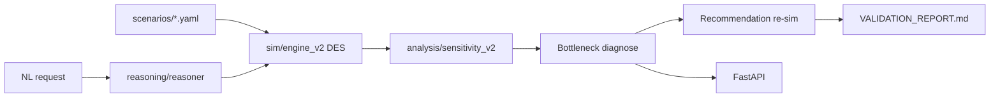
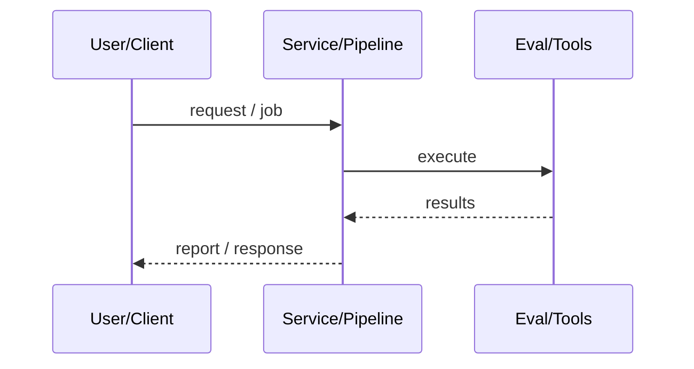
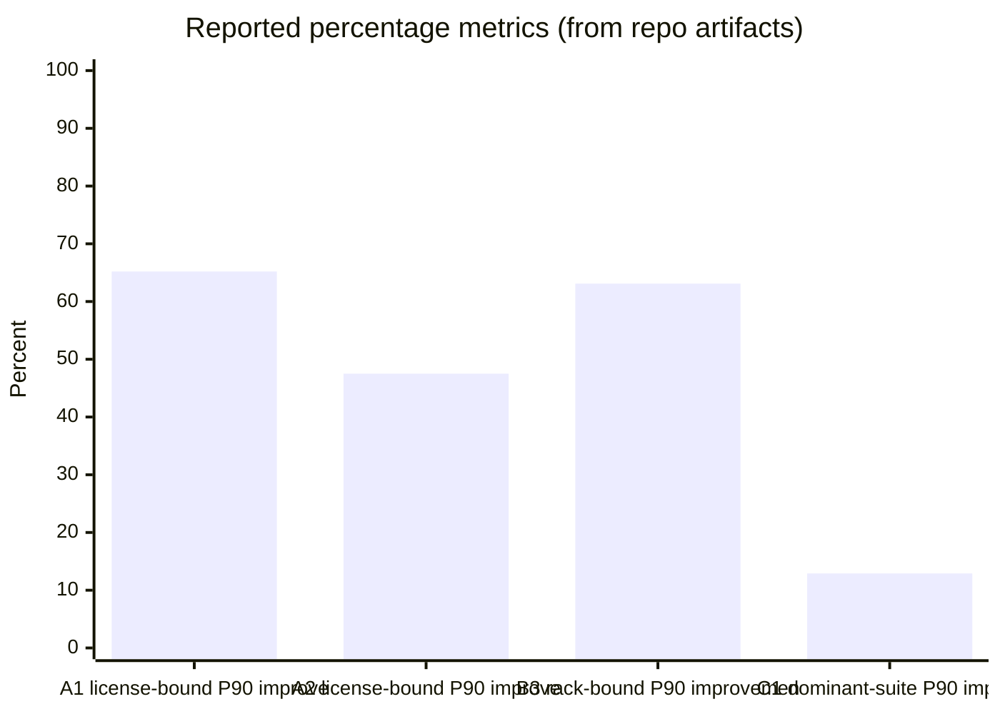
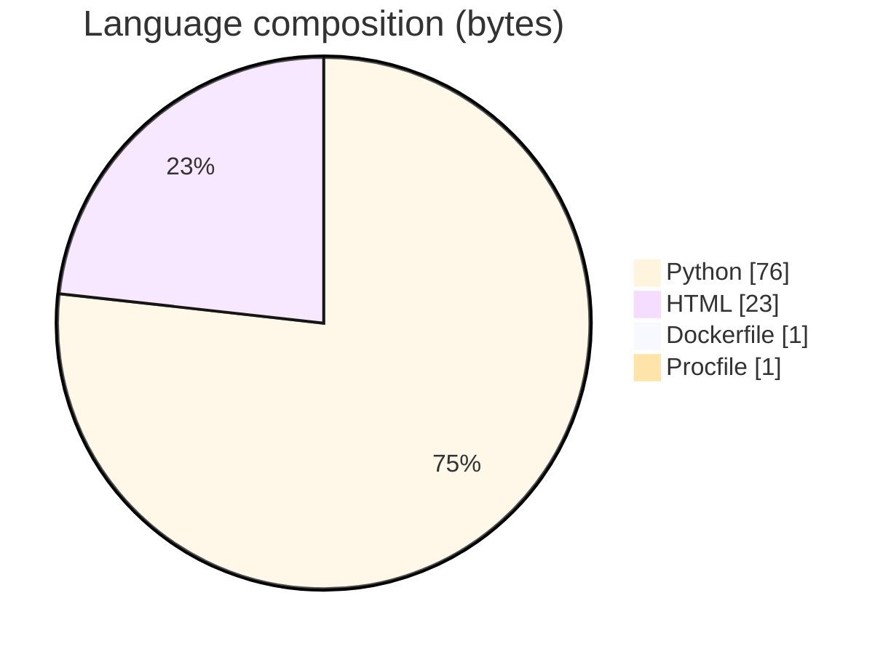

# Validation Lab Capacity-Planning Copilot

### SimPy discrete-event capacity planner that diagnoses licensing, rack, and suite bottlenecks for synthetic chip-validation labs.

[](https://github.com/ArchanaChetan07/validation-lab-capacity-planning-copilot)
[](https://github.com/ArchanaChetan07/validation-lab-capacity-planning-copilot)
[](https://github.com/ArchanaChetan07/validation-lab-capacity-planning-copilot)
[](https://github.com/ArchanaChetan07/validation-lab-capacity-planning-copilot/actions)

---

## Overview

Validation labs struggle to distinguish license-seat, FPGA-rack, or dominant-suite bottlenecks before buying more seats or hardware.

Parameterized YAML scenarios, Monte Carlo DES (SimPy), sensitivity analysis, optional Anthropic reasoning, and FastAPI, validated against known-answer synthetic bottlenecks.

13/13 injected bottlenecks correctly diagnosed; re-simulated fixes cut P90 completion time by ~12.5% to ~65% depending on scenario class.

This repository is maintained as **production-minded portfolio work**: clear architecture, automated checks where present, and metrics that are **traceable to committed artifacts** (never invented).

---

## Architecture

Scenario YAML to DES engine and sensitivity analysis to bottleneck diagnosis to optional LLM reasoner to FastAPI and validation report.





---

## Results & repository facts

> Only values found in code, configs, tests, or generated reports are listed. Absence of a clinical/ML accuracy number means it was **not** published in-repo.

| Metric | Value | Source |
|---|---|---|
| Diagnosis accuracy | **13/13 scenarios** | `VALIDATION_REPORT.md` |
| A1 license-bound P90 improvement | **65.2% (3.27h to 1.14h)** | `VALIDATION_REPORT.md` |
| A2 license-bound P90 improvement | **47.5% (2.14h to 1.12h)** | `VALIDATION_REPORT.md` |
| B3 rack-bound P90 improvement | **63.1% (2.21h to 0.81h)** | `VALIDATION_REPORT.md` |
| C1 dominant-suite P90 improvement | **12.9% (6.06h to 5.28h)** | `VALIDATION_REPORT.md` |
| Tracked files | **58** | `git tree` |
| Python modules | **30** | `git tree` |
| Test-related paths | **9** | `git tree` |
| CI workflows | **Yes** | `.github/workflows` |
| Docker present | **Yes** | `repo root` |





---

## Key features

- Known-answer synthetic scenarios (license/rack/dominant-suite) with YAML sidecars
- SimPy DES engine with P90 completion metrics
- Automatic bottleneck diagnosis and recommendation re-simulation
- FastAPI API for interactive capacity planning
- Anthropic helpers for natural-language scenario specs
- CI-backed pytest package under src/capacity_copilot

---

## Tech stack

| Layer | Technology |
|---|---|
| Language | Python |
| Framework | FastAPI |
| Framework | SimPy |
| Framework | Pydantic |
| API | Anthropic |
| Tool | Prometheus |
| Tool | Docker |
| Tool | pytest |

---

## Skills demonstrated

Python · FastAPI · SimPy · NumPy · SciPy · Prometheus · pytest · CI/CD · testing · automation

Keyword surface: **Python · Python · machine-learning · CI/CD · testing · API · Docker · automation · data-science · software-engineering · system-design · observability · LLM · cloud**

---

## Project structure

```text
validation-lab-capacity-planning-copilot/
├── src/capacity_copilot/
│   ├── api/ models/ sim/ analysis/ reasoning/
├── scenarios/ scripts/ tests/
├── VALIDATION_REPORT.md PROJECT_PLAN.md DEPLOY.md
└── Dockerfile pyproject.toml requirements.txt
```

---

## Installation & usage

```bash
git clone https://github.com/ArchanaChetan07/validation-lab-capacity-planning-copilot.git
cd validation-lab-capacity-planning-copilot
pip install -r requirements.txt
pip install -e .
pytest -q
python scripts/run_validation.py
uvicorn capacity_copilot.api.main:app --reload
```

---

## How it works

Scenarios encode racks, license pools, and test suites with one injected binding constraint. engine_v2 runs Monte Carlo DES for P90 completion time; sensitivity analysis identifies the binding resource; recommendations are re-simulated before scoring PASS in VALIDATION_REPORT.md.

FastAPI (api/main.py) exposes planning endpoints; optional Anthropic reasoner translates natural-language intent into structured specs. All published results are synthetic by design.

---

## Future improvements

- Model priority/preemption contention as its own perturbation candidate
- Replace template README with VALIDATION_REPORT-first narrative
- Optional calibration against anonymized real lab traces

---

## License

See repository.

---

<p align="center">
  <b>Validation Lab Capacity-Planning Copilot</b><br/>
  <a href="https://github.com/ArchanaChetan07/validation-lab-capacity-planning-copilot">github.com/ArchanaChetan07/validation-lab-capacity-planning-copilot</a>
</p>
