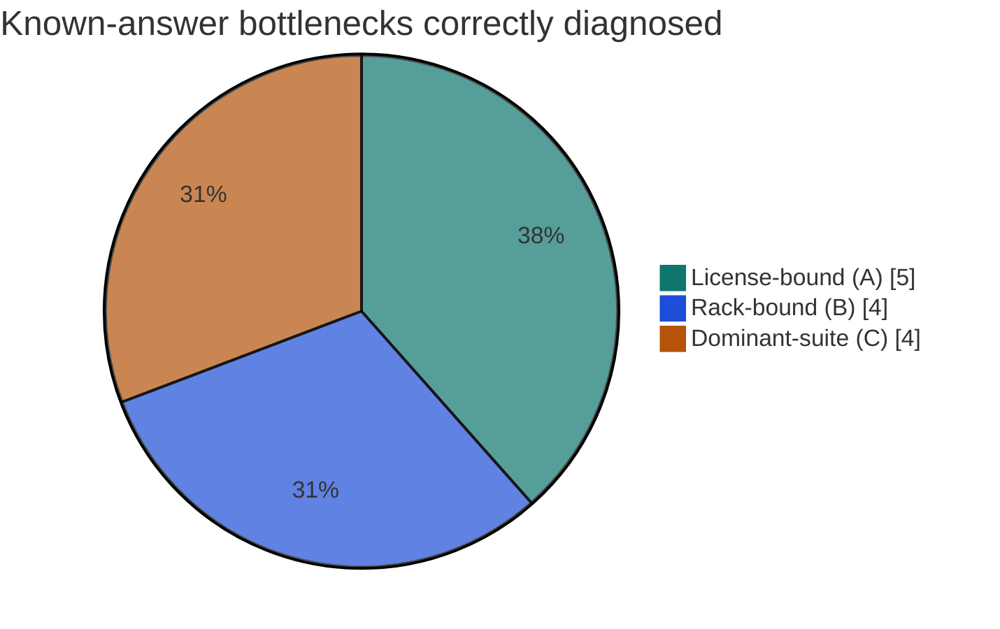
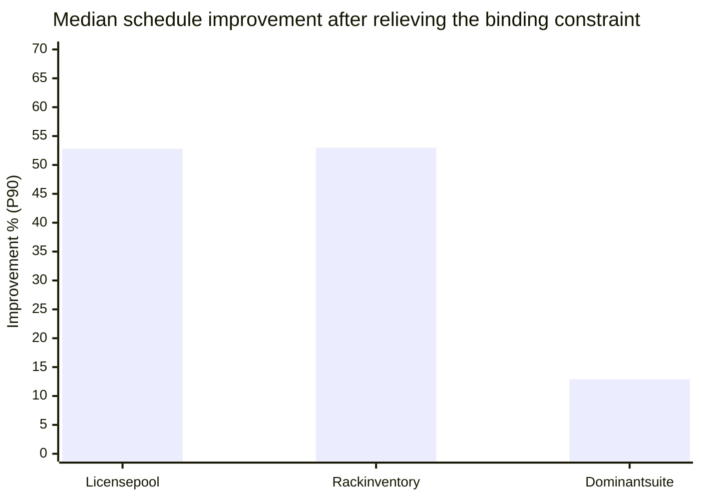
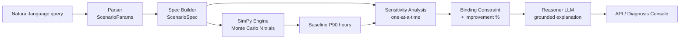
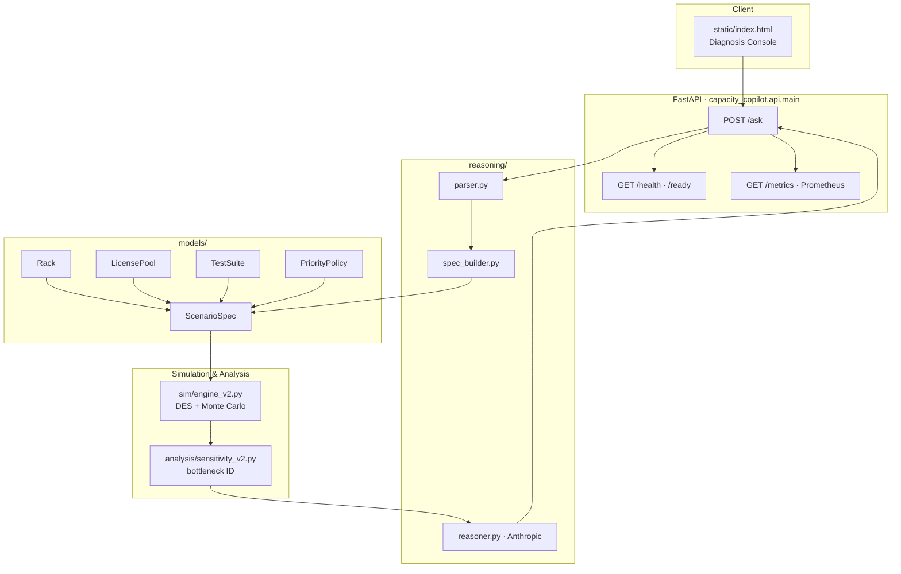
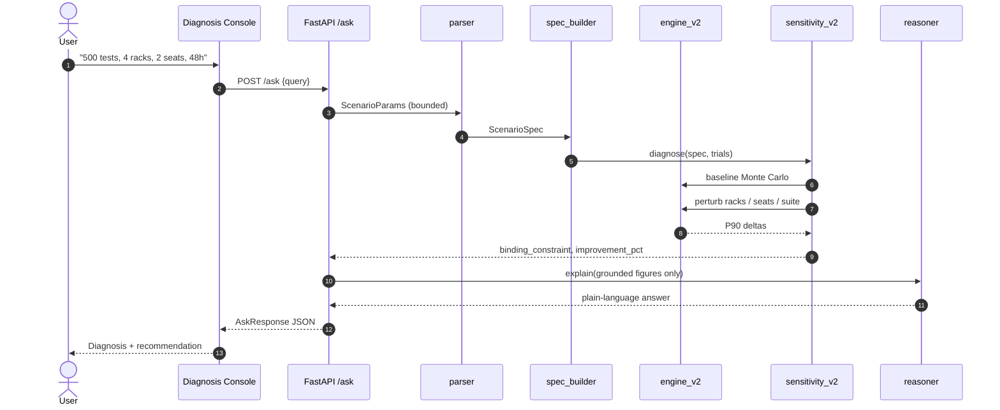
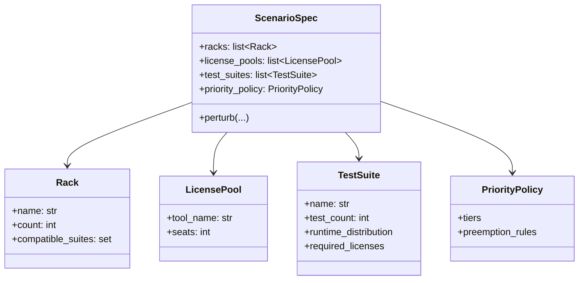
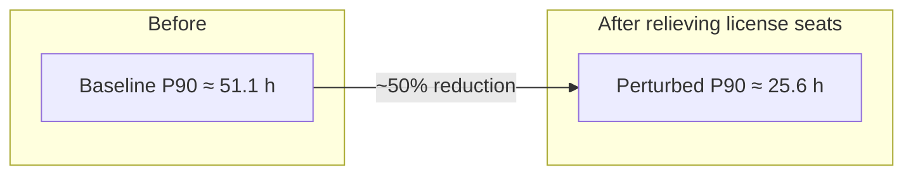
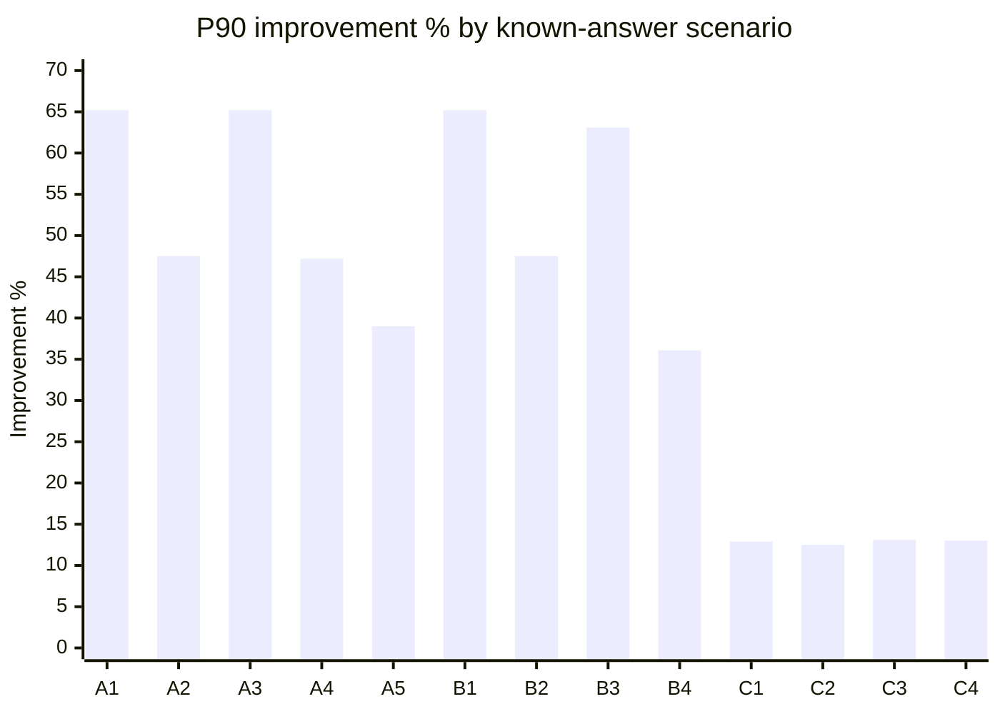
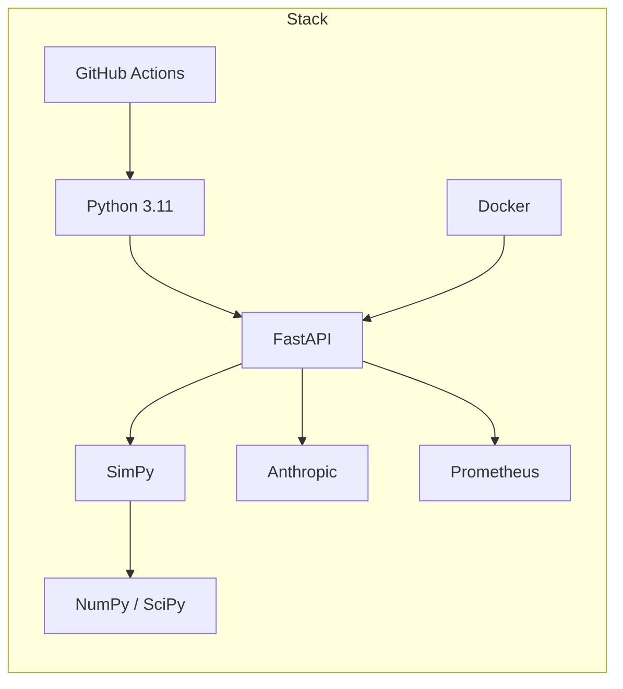

# Validation Lab Capacity-Planning Copilot

[](https://github.com/ArchanaChetan07/validation-lab-capacity-planning-copilot/actions/workflows/ci.yml)
[](https://www.python.org/)
[](https://fastapi.tiangolo.com/)
[](https://simpy.readthedocs.io/)
[](./tests)
[](./VALIDATION_REPORT.md)
[](#disclaimer)

> Ask: *"50,000 tests, 12 racks, 4 license seats, deadline 96 hours"*  
> Get: a Monte Carlo discrete-event simulation, a quantified binding constraint, and a plain-language explanation — **every number grounded in the simulator, never invented by the LLM**.

An end-to-end **Python / FastAPI** system that turns natural-language capacity questions into **binding-constraint diagnoses** for hardware validation labs (racks, shared tool licenses, and dominant slow test suites).

---

## Highlights at a Glance

| Dimension | Result |
|---|---|
| Diagnosis accuracy (injected bottlenecks) | **13 / 13** known-answer scenarios |
| Unit / integration tests | **24 / 24** passing |
| Quantitative source of truth | **SimPy** Monte Carlo DES → P90 completion time |
| Explanation layer | **Anthropic Claude** constrained to simulator outputs only |
| Production surface | FastAPI + diagnosis console UI + Prometheus metrics + Docker |
| CI | GitHub Actions (`pytest` on every push) |





> Bars use the median improvement from each scenario family in [`VALIDATION_REPORT.md`](VALIDATION_REPORT.md).

---

## Problem → Solution

Hardware validation labs routinely mis-attribute schedule slip to the wrong scarce resource. Adding racks when the real limiter is a **license seat pool** wastes budget; tuning a suite when **rack count** binds wastes time.

This copilot:

1. **Parses** a free-text capacity question into structured parameters  
2. **Builds** a domain model (racks, license pools, suites, priority policy)  
3. **Simulates** the campaign with Monte Carlo discrete-event scheduling  
4. **Perturbs** one candidate constraint at a time  
5. **Selects** the binding bottleneck as the perturbation with the largest P90 gain  
6. **Explains** the result in natural language using only grounded figures  



---

## System Architecture



### Design contract (NFR-2)

| Layer | Responsibility | May invent numbers? |
|---|---|---|
| `engine_v2` + `sensitivity_v2` | Completion time, binding constraint, % improvement | No — sole quantitative authority |
| `reasoner` | Narrative + recommendation language | No — cites simulator outputs only |
| `parser` | Extract / clamp inputs | — |

If the LLM path fails, `/ask` still returns grounded simulation fields with a degraded explanation string — the numeric diagnosis is never discarded because the chat layer errored.

---

## Request Lifecycle



---

## Domain Model



Resources compete under SimPy: jobs acquire compatible racks and license seats, run sampled durations, then release — Monte Carlo trials yield a **P90 completion time**, not a single point estimate.

---

## Example Diagnosis (Live API Shape)

**Query**

```json
{
  "query": "500 tests, 4 racks, 2 license seats, deadline 48 hours"
}
```

**Response (structure)**

```json
{
  "answer": "…plain-language explanation citing only simulator figures…",
  "completion_time_hours": 51.1,
  "binding_constraint": "license_seats:shared_tool",
  "improvement_pct": 49.8,
  "notes": []
}
```



---

## Validation Results

All scenarios are **synthetic** with an injected ground-truth bottleneck. The pipeline never sees the label; diagnosis is scored after the fact.

| Family | Injected truth | Count | Correct |
|---|---|---:|---:|
| A — License-bound | `license_seats` | 5 | 5 |
| B — Rack-bound | `rack_count` | 4 | 4 |
| C — Dominant suite | `dominant_suite` | 4 | 4 |
| **Total** | | **13** | **13** |



Full methodology and per-scenario table: **[`VALIDATION_REPORT.md`](VALIDATION_REPORT.md)**.

---

## Technology Stack

| Layer | Stack |
|---|---|
| Language | Python 3.11+ |
| API | FastAPI, Uvicorn, Pydantic v2 |
| Simulation | SimPy 4 (discrete-event), NumPy, SciPy |
| Reasoning | Anthropic Claude API (grounded explanations) |
| Observability | Prometheus client (`/metrics`) |
| Packaging / Deploy | Docker (non-root), Procfile, Railway config |
| Quality | pytest, pytest-cov, GitHub Actions CI |
| Config | python-dotenv, PyYAML |



---

## Repository Layout

```text
capacity-copilot/
├── src/capacity_copilot/
│   ├── models/                 # Rack, LicensePool, TestSuite, PriorityPolicy, ScenarioSpec
│   ├── sim/engine_v2.py        # Monte Carlo discrete-event simulation
│   ├── analysis/sensitivity_v2.py
│   ├── reasoning/              # parser → spec_builder → reasoner
│   ├── api/main.py             # /ask, /health, /ready, /metrics
│   └── observability/
├── static/index.html           # Diagnosis console UI
├── scenarios/                  # 13 known-answer synthetic scenarios (+ YAML sidecars)
├── scripts/run_validation.py   # Regenerates VALIDATION_REPORT.md
├── tests/                      # 24 unit / integration tests
├── .github/workflows/ci.yml
├── Dockerfile · Procfile · railway.json
├── PROJECT_PLAN.md · LIMITATIONS.md · DEPLOY.md
└── requirements.txt            # Pinned dependency versions
```

---

## Quick Start

### Prerequisites

- Python **3.11+**
- Anthropic API key (optional for numbers-only mode; required for full LLM explanations)

### Install & run

```bash
git clone https://github.com/ArchanaChetan07/validation-lab-capacity-planning-copilot.git
cd validation-lab-capacity-planning-copilot

python -m venv .venv
# Windows: .\.venv\Scripts\Activate.ps1
# macOS/Linux:
source .venv/bin/activate

pip install -r requirements.txt
cp .env.example .env   # set ANTHROPIC_API_KEY=

# Windows PowerShell
$env:PYTHONPATH = "src"
uvicorn capacity_copilot.api.main:app --reload --host 127.0.0.1 --port 8000

# macOS/Linux
export PYTHONPATH=src
uvicorn capacity_copilot.api.main:app --reload --host 127.0.0.1 --port 8000
```

Open **http://127.0.0.1:8000** for the diagnosis console, or **http://127.0.0.1:8000/docs** for the OpenAPI UI.

### Tests & known-answer validation

```bash
PYTHONPATH=src python -m pytest tests/ -q
PYTHONPATH=src python scripts/run_validation.py
```

### Deploy

Container and platform notes for Railway / Render / Fly.io: **[`DEPLOY.md`](DEPLOY.md)**.

---

## HTTP Surface

| Method | Path | Purpose |
|---|---|---|
| `POST` | `/ask` | Run parse → simulate → diagnose → explain |
| `GET` | `/health` | Liveness |
| `GET` | `/ready` | Readiness + `llm_configured` flag |
| `GET` | `/metrics` | Prometheus metrics |
| `GET` | `/` | Diagnosis console (static UI) |

Optional shared-secret auth: set `COPILOT_API_KEY` and send header `X-API-Key`.

---

## What’s In Scope vs Out of Scope

**Shipped**

- Heterogeneous racks, named license pools, runtime distributions, priority/preemption policy  
- Monte Carlo DES → P90 completion time  
- One-at-a-time sensitivity over racks, seats, and dominant suite  
- Grounded LLM explanations with graceful degradation  
- Live API + UI wired to the real pipeline (not a mock)  
- 13/13 known-answer validation + production hardening (bounds, error isolation, non-root Docker, pinned deps)

**Explicitly deferred** — see [`LIMITATIONS.md`](LIMITATIONS.md)

- Multi-suite campaigns from free-text chat (available via `scenarios/definitions.py`)  
- Priority/preemption as its own diagnostic candidate  
- Existing queue / backlog modeling in the live query path  
- Hosted Grafana board (Prometheus scrape endpoint is live)

---

## Documentation Map

| Document | Contents |
|---|---|
| [`PROJECT_PLAN.md`](PROJECT_PLAN.md) | Functional / non-functional requirements, phased build plan |
| [`VALIDATION_REPORT.md`](VALIDATION_REPORT.md) | Scenario-level pass/fail + methodology |
| [`LIMITATIONS.md`](LIMITATIONS.md) | Honest scope boundaries and fixed audit findings |
| [`DEPLOY.md`](DEPLOY.md) | Deploy steps + production-hardening changelog |

---

## Disclaimer

> **All scenarios, runtimes, rack counts, and license seat counts in this repository are synthetic** and constructed for known-answer evaluation. No proprietary lab inventory or operational schedules are included.

---

## Author

**Archana Chetan** · [@ArchanaChetan07](https://github.com/ArchanaChetan07)

Built to demonstrate production-minded systems work across **discrete-event simulation, sensitivity analysis, constrained LLM reasoning, FastAPI services, observability, CI, and containerized deploy**.
