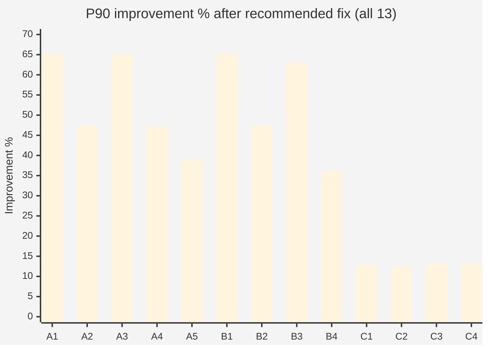
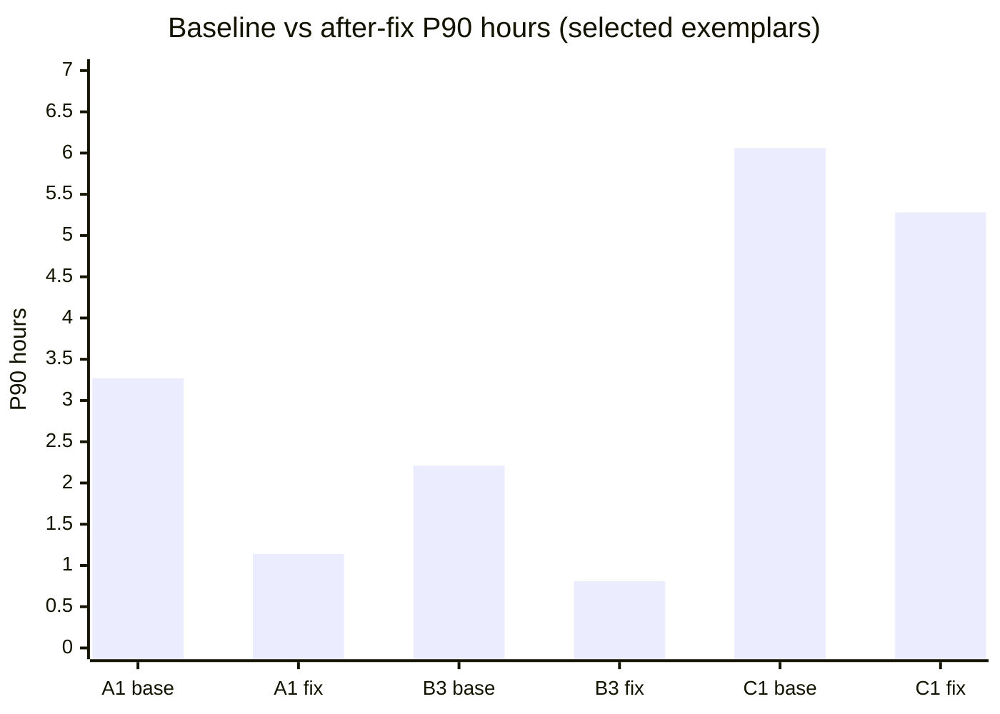
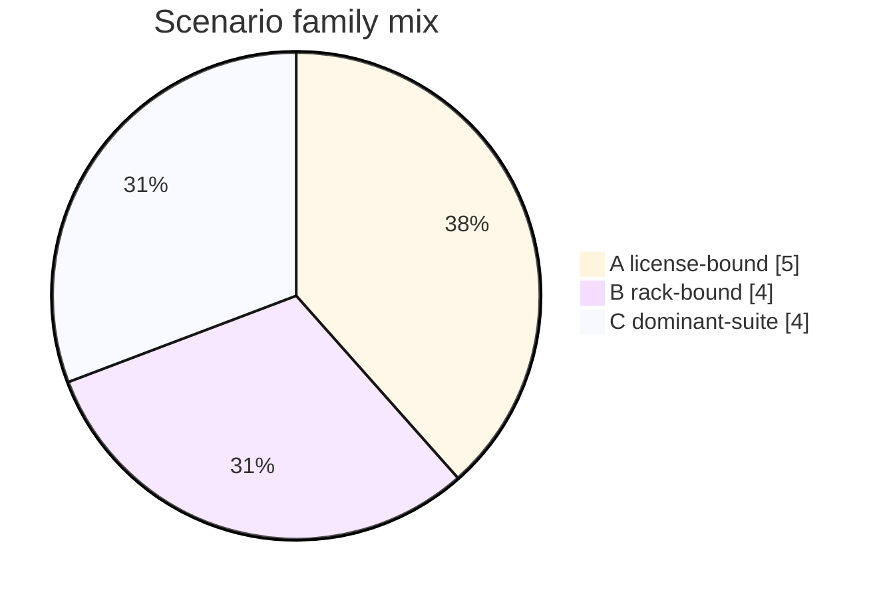
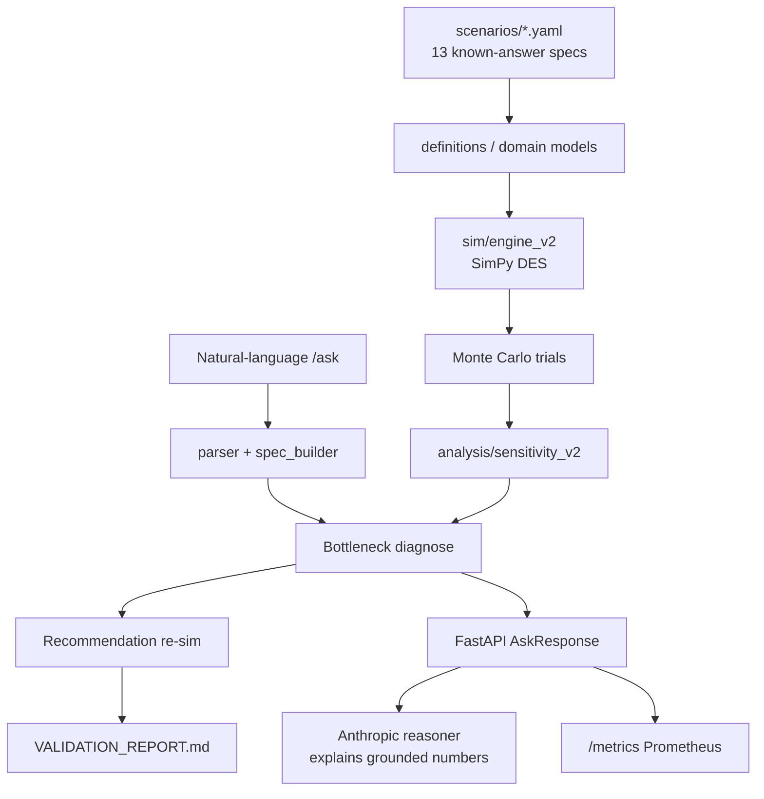
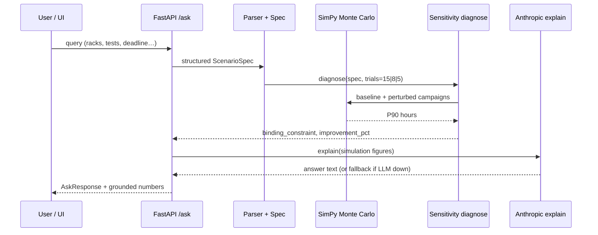
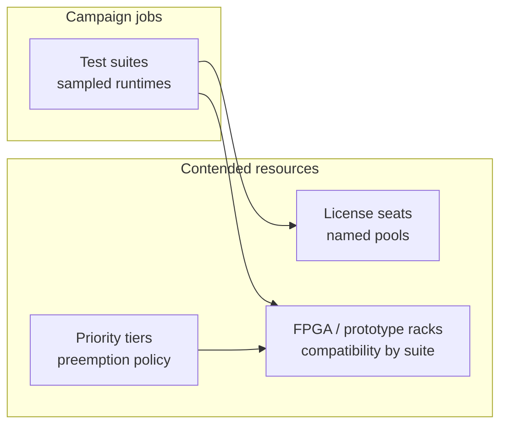
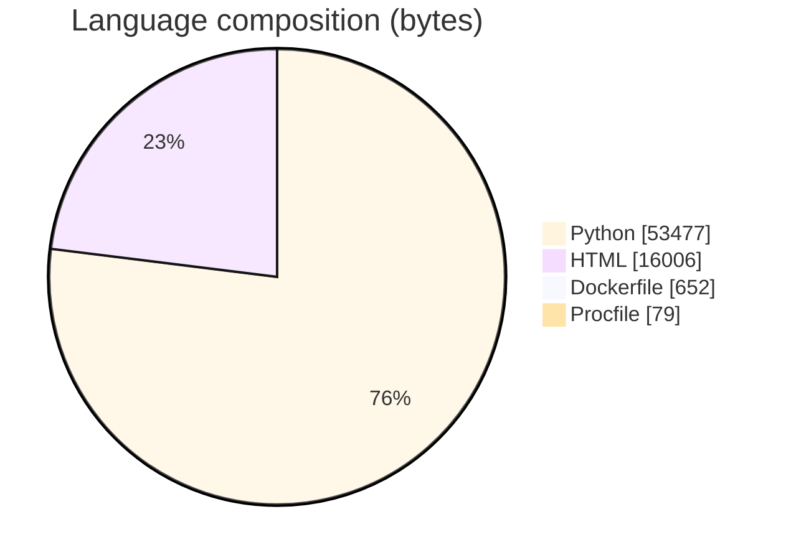

# Validation Lab Capacity-Planning Copilot

### SimPy Monte Carlo capacity planner that **diagnoses license · rack · suite bottlenecks** for synthetic chip-validation labs — FastAPI + optional Anthropic explanations

<p align="center">
  
  
  
  
</p>

<p align="center">
  
  
  
  <a href="VALIDATION_REPORT.md"></a>
  
</p>

---

## Overview

FPGA / emulation **validation labs** often mis-buy seats or racks because queueing contention is invisible. This copilot:

1. Loads **parameterized YAML scenarios** with one **injected ground-truth bottleneck**
2. Runs **Monte Carlo discrete-event simulation** (SimPy + NumPy runtime sampling)
3. Performs **sensitivity analysis** (perturb racks / licenses / dominant suite)
4. **Diagnoses** the binding constraint and **re-simulates** the recommended fix
5. Serves results via **FastAPI** (`/ask`) with optional **Anthropic** natural-language explanation
6. Emits **Prometheus** metrics at `/metrics`

All quantitative claims come from the simulator — the LLM only explains numbers it is given ([`LIMITATIONS.md`](LIMITATIONS.md), NFR-2).

> **Results are not changed.** Tables below match [`VALIDATION_REPORT.md`](VALIDATION_REPORT.md) exactly. Scenarios are **fully synthetic** — no real employer/lab data.

---

## Results (from `VALIDATION_REPORT.md`)

### Headline

| Metric | Value |
|--------|--------|
| Diagnosis accuracy | **13/13** scenarios correctly named the injected bottleneck |
| Recommendation validity | **13/13** re-simulations reduced P90 completion time |
| Scenario families | **A** license-bound (**5**) · **B** rack-bound (**4**) · **C** dominant-suite (**4**) |

### Full known-answer table (unchanged)

| Scenario | Known bottleneck | Diagnosed | Baseline P90 (h) | After fix P90 (h) | Improvement | Diagnosis | Rec. valid |
|----------|------------------|-----------|-----------------:|------------------:|------------:|:---------:|:----------:|
| A1_license_bound | license_seats | license_seats:dft_tool | **3.27** | **1.14** | **65.2%** | PASS | yes |
| A2_license_bound | license_seats | license_seats:dft_tool | **2.14** | **1.12** | **47.5%** | PASS | yes |
| A3_license_bound | license_seats | license_seats:dft_tool | **2.76** | **0.96** | **65.2%** | PASS | yes |
| A4_license_bound | license_seats | license_seats:dft_tool | **3.20** | **1.69** | **47.2%** | PASS | yes |
| A5_license_bound | license_seats | license_seats:dft_tool | **2.83** | **1.73** | **39.0%** | PASS | yes |
| B1_rack_bound | rack_count | rack_count:fpga_prototype | **3.27** | **1.14** | **65.2%** | PASS | yes |
| B2_rack_bound | rack_count | rack_count:fpga_prototype | **2.14** | **1.12** | **47.5%** | PASS | yes |
| B3_rack_bound | rack_count | rack_count:fpga_prototype | **2.21** | **0.81** | **63.1%** | PASS | yes |
| B4_rack_bound | rack_count | rack_count:fpga_prototype | **2.16** | **1.38** | **36.1%** | PASS | yes |
| C1_dominant_suite_bound | dominant_suite | dominant_suite:slow_suite | **6.06** | **5.28** | **12.9%** | PASS | yes |
| C2_dominant_suite_bound | dominant_suite | dominant_suite:slow_suite | **4.88** | **4.27** | **12.5%** | PASS | yes |
| C3_dominant_suite_bound | dominant_suite | dominant_suite:slow_suite | **7.59** | **6.60** | **13.1%** | PASS | yes |
| C4_dominant_suite_bound | dominant_suite | dominant_suite:slow_suite | **4.71** | **4.10** | **13.0%** | PASS | yes |







### Methodology (report)

1. Inject one known-answer bottleneck per YAML scenario  
2. Blind pipeline: Monte Carlo DES → sensitivity → bottleneck ID  
3. **Diagnosis PASS** iff identified constraint matches ground truth  
4. **Recommendation valid** iff re-sim with fix lowers P90 (not assert-only)

---

## Architecture







**Engine detail:** `engine_v2` requests the **license before the rack** so seats aren’t held while queued on licenses (rack-hostage fix documented in `LIMITATIONS.md`).

---

## Domain scenarios (examples)

| ID | Injected bind | Shape |
|----|---------------|--------|
| A1 | 1 `dft_tool` seat · 20 racks · 30 tests | License binds |
| B3 | 1 rack · 25 seats · 20 tests | Rack binds |
| C1 | 200×4min + 10×150min · adequate capacity | `slow_suite` dominates |

Full A1–A5 / B1–B4 / C1–C4 descriptions live in [`VALIDATION_REPORT.md`](VALIDATION_REPORT.md).

---

## API & observability

| Endpoint | Role |
|----------|------|
| `POST /ask` | NL → simulate → diagnose → explain |
| `GET /metrics` | Prometheus: `copilot_requests_total`, errors, latency histogram |
| Static UI | `static/index.html` |

**Trial scaling** (latency bound): `trials = 15` if `test_count ≤ 2000`, else `8` if ≤ 5000, else `5`.

Optional `COPILOT_API_KEY` → require `X-API-Key` (protects Anthropic budget). Reasoner failures still return **grounded sim numbers**.

---

## Repository layout

```text
validation-lab-capacity-planning-copilot/
├── VALIDATION_REPORT.md              # 13/13 evidence table
├── PROJECT_PLAN.md · LIMITATIONS.md · DEPLOY.md
├── scenarios/                        # A*/B*/C* YAML + definitions.py
├── src/capacity_copilot/
│   ├── sim/engine_v2.py              # SimPy DES + monte_carlo
│   ├── analysis/sensitivity_v2.py    # diagnose()
│   ├── models/                       # rack, license, suite, priority
│   ├── reasoning/                    # parser, reasoner, spec_builder
│   └── api/main.py                   # FastAPI + Prometheus
├── tests/                            # pytest package
├── scripts/run_validation.py
├── static/index.html
└── Dockerfile · railway.json · requirements.txt
```

Languages (GitHub bytes): Python **53,477** · HTML **16,006** · Dockerfile **652** · Procfile **79** · **58** files.



---

## Tech stack & keywords

| Layer | Technology |
|-------|------------|
| Simulation | **SimPy 4.1.2**, NumPy RNG sampling |
| Stats | **SciPy**, P90 aggregation |
| API | **FastAPI**, Uvicorn, Pydantic |
| Reasoning | **Anthropic** SDK (explanation only) |
| Observability | **prometheus-client** |
| Config | YAML scenarios, python-dotenv |
| Quality | **pytest**, GitHub Actions, Docker / Railway |

**Keyword surface:** Python · discrete-event simulation · SimPy · Monte Carlo · capacity planning · bottleneck diagnosis · sensitivity analysis · FPGA validation lab · license seats · FastAPI · Prometheus · Anthropic · Pydantic · pytest · CI/CD · systems engineering · operations research

---

## Quickstart

```bash
git clone https://github.com/ArchanaChetan07/validation-lab-capacity-planning-copilot.git
cd validation-lab-capacity-planning-copilot

pip install -r requirements.txt
pip install -e .
pytest -q
python scripts/run_validation.py    # regenerates / checks known-answer table

uvicorn capacity_copilot.api.main:app --reload
# POST /ask  ·  GET /metrics  ·  open static UI
```

Set `ANTHROPIC_API_KEY` for LLM explanations (simulation works without it; see reasoner fallback).

---

## Honest scope

- **13/13** = correct ID of injected bottlenecks across **synthetic** A/B/C families — **not** proof on real lab traces  
- Priority/preemption is **queued** in SimPy but **not** yet a sensitivity candidate  
- Chat UI builds **single-suite** specs; multi-suite YAML pack is validation-path  
- Dominant-suite “fix” = **15%** mean runtime proxy (directional)

See [`LIMITATIONS.md`](LIMITATIONS.md).

---

<p align="center">
  <b>Validation Lab Capacity-Planning Copilot</b><br/>
  <a href="https://github.com/ArchanaChetan07/validation-lab-capacity-planning-copilot">github.com/ArchanaChetan07/validation-lab-capacity-planning-copilot</a>
</p>
